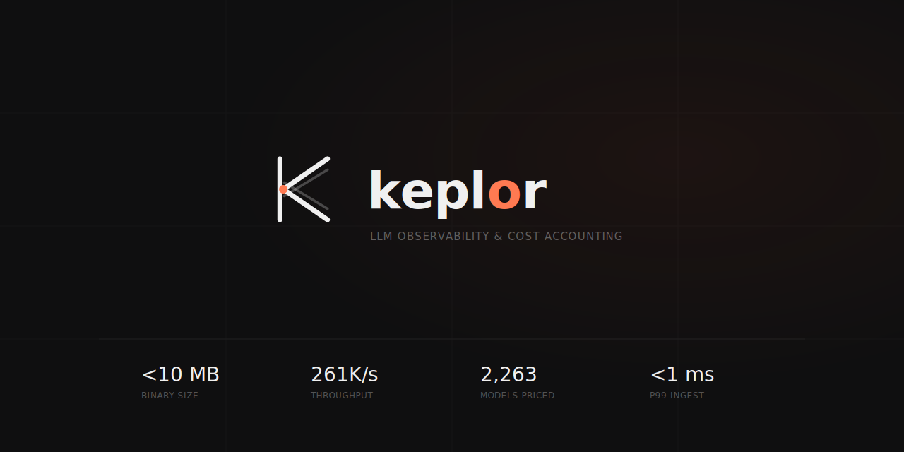

<p align="center">
  
</p>

# Keplor

> Observe every LLM request. Know exactly what it cost.

**Status:** pre-alpha — under active development.

Keplor is a lightweight LLM logs ingestion and cost-accounting server. Your application, gateway, or SDK wrapper POSTs event data after each LLM call — Keplor validates it, auto-computes cost from a bundled pricing catalog covering every major provider (OpenAI, Anthropic, Gemini, Bedrock, Azure, Mistral, Groq, xAI, DeepSeek, Cohere, Ollama, and any OpenAI-compatible endpoint), compresses and stores it in a local SQLite database, and serves real-time aggregations and rollups.

Named for Johannes Kepler, who derived the laws of planetary motion from observations others recorded. Keplor does the same — it turns the LLM logs your systems send it into precise cost and usage insights.

## What makes it different

- **Single static binary** under 10 MB. No Postgres. No ClickHouse. No Kafka. No Redis. SQLite works out of the box.
- **Pure ingestion** — no LLM traffic touches Keplor. Your app or gateway POSTs events after the fact. No routing, no interception, no request rewriting.
- **Every provider schema** — accepts events from OpenAI, Anthropic, Gemini, Bedrock, and 8 more providers, with correct token-type handling for each.
- **Heavy compression** via zstd with trained dictionaries per provider and component type — 30–80× ratios on real conversational traffic.
- **Precise cost accounting** using the industry-standard LiteLLM pricing catalog, with correct handling of prompt caching, reasoning tokens, batch discounts, modality rates, tier pricing, and geo multipliers.
- **Dual-schema telemetry** — every span carries both OpenTelemetry GenAI and OpenInference attributes, so Langfuse, Phoenix, LangSmith, Datadog, Honeycomb, and Grafana Tempo all ingest cleanly without reconfiguration.

## Quickstart

```bash
# Build and run
cargo build --release
./target/release/keplor run

# POST an event after your LLM call
curl -X POST http://localhost:8080/v1/events \
  -H "Content-Type: application/json" \
  -d '{"model":"gpt-4o","provider":"openai","usage":{"input_tokens":500,"output_tokens":200}}'

# Check storage stats
./target/release/keplor stats
```
## License

Apache-2.0.
